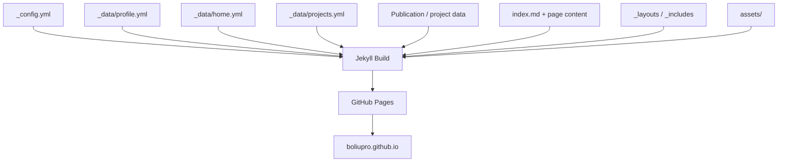
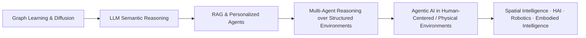
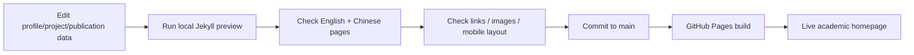

<div align="center">

# Bo Liu — Academic Homepage
### Personal Academic Website for Research, Publications, Projects, Awards, and Hobbies

[](https://boliupro.github.io)


**Live site: https://boliupro.github.io**

</div>

## Overview

This repository powers my personal academic homepage. It is designed as a lightweight, data-driven Jekyll site for presenting my research trajectory, publications, research projects, awards, hobbies, contact information, and PhD-application profile in a consistent academic style.

The site currently presents me as a third-year Master’s student at the **College of Computer Science and Electronic Engineering, Hunan University** and the **National Supercomputing Center in Changsha**, advised by **Prof. Zhu Xiao** and **Prof. Tong Li**. The research narrative follows the same four-stage progression used in my GitHub profile:

1. graph learning and diffusion modeling;
2. LLM-based semantic reasoning;
3. retrieval-augmented and personalized agents;
4. multi-agent reasoning over evolving structured environments.

The homepage also states that I am **exploring PhD opportunities for Fall 2027**, with broad interests in Agentic AI, spatial/spatiotemporal intelligence, human-centered AI, robotics and embodied intelligence.

## Site Structure



## Main Sections

The website is organized around an academic-portfolio structure:

- **Home** — biography, research trajectory, selected recent content and contact links;
- **Publications** — papers, venue/status information, paper/code links;
- **Projects** — research and engineering projects with detailed pages;
- **Awards** — scholarships and honors;
- **Hobbies** — personal interests beyond research;
- **中文** — Chinese-language presentation of the homepage/profile content.

## Content Architecture

The site separates content from presentation so that repeated information can be updated in one place.

### `_data/profile.yml`

Stores profile-level information such as:

- name and role;
- affiliation;
- research interests;
- location and contact links;
- Google Scholar / GitHub / ORCID / website metadata.

### `_data/home.yml`

Controls homepage-level content blocks and preview sections.

### `_data/projects.yml`

Stores project metadata used by the homepage, Projects page and project detail views. Project records can include fields such as:

- full title and `short_title`;
- description;
- image / preview information;
- code or anonymous-code links;
- `youtube_id` for embedded demos;
- other project-specific metadata.

### `index.md`

Contains the main English homepage biography and research narrative.

### `docs/english-homepage-copy.md`

Keeps the long-form English homepage/profile copy and PhD-application wording in one place for reference and consistency.

## Homepage Preview System

The homepage renders compact horizontal preview rows from shared content data. `short_title` fields keep card headings concise while full titles remain available on detail pages.

For project demos, `youtube_id` can be defined once in `_data/projects.yml` and reused by both the project-detail player and the Projects demo gallery. Publication entries can use an optional `anonymous` field for anonymous-code buttons where appropriate.

## Research Narrative

The website intentionally presents research as a coherent progression rather than as a disconnected list of papers:



This narrative is also synchronized with the GitHub profile repository `BoLiupro/BoLiuPro` so that visitors see the same research identity across the website and GitHub profile.

## PhD Application

The site currently includes the following application direction:

> I am currently exploring PhD opportunities for Fall 2027. My interests broadly lie in Agentic AI, Spatiotemporal and Spatial Intelligence, Human-Centered AI, Robotics, and Embodied Intelligence.

The homepage and GitHub profile are maintained together so future advisor/research-interest updates can remain consistent.

## Local Development

This is a Jekyll/GitHub Pages site. With Ruby and Bundler available, a typical local workflow is:

```bash
bundle install
bundle exec jekyll serve
```

Then open the local address printed by Jekyll (commonly `http://127.0.0.1:4000`).

If the repository uses the GitHub Pages dependency set, keeping the local Ruby/Bundler environment close to GitHub Pages helps reduce deployment differences.

## Jekyll Configuration

Key settings in `_config.yml` include:

```yaml
title: Bo Liu
url: https://boliupro.github.io
lang: en
timezone: Asia/Shanghai
markdown: kramdown
permalink: pretty
```

The site defines a custom `projects` collection and excludes development/documentation directories from the generated site.

## Typical Editing Workflow



For most content updates, prefer editing the relevant `_data/*.yml` file rather than duplicating the same information across multiple page templates.

## Repository Organization

The exact file set evolves with the website, but the major structure follows this pattern:

```text
boliupro.github.io/
├── _config.yml              # Jekyll configuration
├── _data/
│   ├── profile.yml          # Shared personal profile metadata
│   ├── home.yml             # Homepage sections
│   └── projects.yml         # Project metadata / demos
├── _layouts/                # Page layouts
├── _includes/               # Reusable HTML/Liquid components
├── _projects/               # Project detail pages (Jekyll collection)
├── assets/                  # CSS, JavaScript, images and static assets
├── docs/                    # Editing/reference documentation
├── index.md                 # Main English homepage
└── README.md                # Repository documentation
```

## Design Goals

The site is intentionally designed around a few principles:

- **Academic-first:** research identity and publications should be immediately understandable;
- **Consistent:** homepage, project pages and GitHub profile should describe the same research trajectory;
- **Readable:** use compact cards and detailed pages rather than dense walls of metadata;
- **Maintainable:** put reusable information in structured data files;
- **Bilingual:** support English for international academic communication and Chinese for local readers;
- **Lightweight:** use static-site generation and GitHub Pages rather than a heavy web stack.

## Contact

**Bo Liu**  
College of Computer Science and Electronic Engineering, Hunan University  
National Supercomputing Center in Changsha  
Email: `liubo317@hnu.edu.cn`  
Google Scholar: https://scholar.google.com/citations?user=n7mQs-MAAAAJ  
GitHub: https://github.com/BoLiupro

For research discussion or PhD-related communication, please feel free to reach out.
